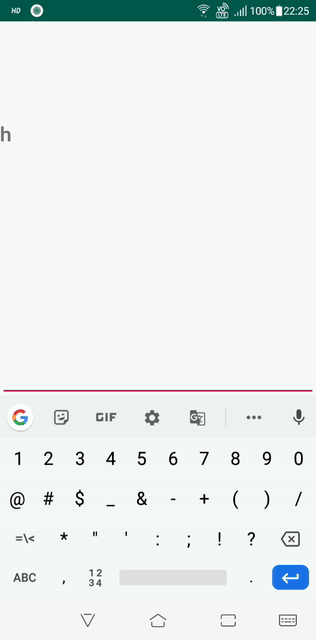

# UltimateTextView
[](https://android-arsenal.com/api?level=19) [](https://www.jitpack.io/#debojyoti452/UltimateTextView)

### Tag = V1.0
## Sample
<p align="center"> 

</p>

## Description
<b>You can now fit your textview automatically and even by using these library you can directly customize your font through XML implementation. You can check sample folder for futher explanation.</b>

## Requirement
* Must use AndroidX
* Kotlin Supported

## Installation
#### Project Level Gradle
```java
allprojects {
		repositories {
			maven { url 'https://www.jitpack.io' }
		}
	}
```
#### App Level Gradle
```java
dependencies {
	    implementation 'com.github.debojyoti452:UltimateTextView:Tag'
	}
```

## Code Sample
#### XML Implementation
```xml
<com.dev452.ultimatetextview.UltimateTextView
            android:id="@+id/textViewDemo"
            android:layout_width="match_parent"
            android:layout_height="wrap_content"
            android:layout_centerInParent="true"
            android:text="@string/app_name"
            android:textSize="22sp"
            android:maxLines="3"
            app:UTVAutoFitEnabled="true"
            app:UTVFonts="@string/exo_semibold"
            app:UTVMinTextSize="12sp"
            app:UTVSingleLine="false" />
```

## Future Development
* Fade In Animation
* Bold, Italic, Strike Features

## Contribution
Feel free to pull request.

Find this library useful? ❤️
Support it by joining stargazers for this repository. ⭐️
